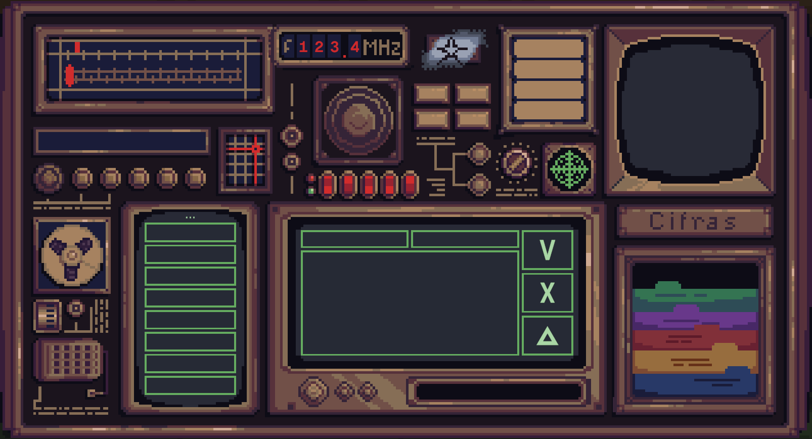

# ANTENA2
Antena 2 é um jogo que consiste em.
## Menu Inicial

O menu inicial possui quatro botões: 

- Jogar: dá play no jogo;

- Créditos: abre informações sobre quem fez o jogo;

- Sair: fecha o jogo;

- Configurações: abre o painel para configurar as opções.

## Configurações de jogo e acessibilidade

Opções do painel de configurações:

- Buscando alcançar maior acessibilidade auditiva implementamos três opções de mudanças de volume:
    
* Volume geral (volume da música e efeitos sonoros juntos);

    
* Volume da música;

    
* Efeitos sonoros;

    

    

- Área de dificuldade que controla a quantidade de tarefas durante o jogo.

- Para acessibilidade visual:

    
* Opções de filtros de daltonismo:  protanopia, deuteranopia, tritanopia e sem filtro.

## Cenas
### Mesa de Trabalho

Essa é a mesa de transmissão, a cena principal de nosso jogo, o local que o personagem passará mais tempo, onde ele trabalha.

### Cabana

Essa é a casa que abriga o novo trabalhador da Antena 2, possui uma sala integrada a cozinha, um armazém, sala de transmissão e, ao subir as escadas, se acessa o dormitório e banheiro, entretanto ao subí-la, infere-se que o personagem foi dormir e o dia acaba para que outro se inicie. 

