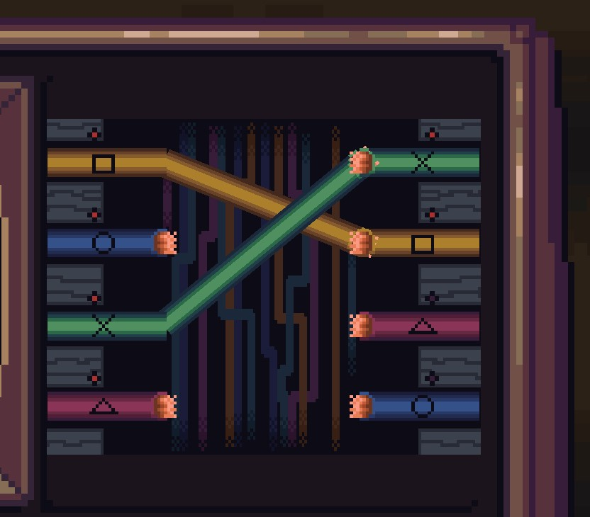

# ANTENA2

Antena 2 é um jogo de decisões. Ajudar rebeldes ou seguir o governo? É o que deve se pensar no jogo, pois ao jogar você se encontra na pele de um trabalhador cuja função é retransmitir mensagens vindas de várias origens. Ao ler uma mensagem, decida retransmiti-la, apagá-la ou denuncia-la. Siga seu trabalho retransmitindo mensagens governamentais ou colabore com a comunicação dos rebeldes. Devido a esse trabalho, o jogo se passa em uma cabana com as bugingangas necessárias para controlar a Antena 2, dentre elas a grande mesa de transmissão. Aproveite sua acomodação nada usual e explore-a! 

## Menu Inicial

O menu inicial possui quatro botões: 

- Jogar: dá play no jogo;

- Créditos: abre informações sobre quem fez o jogo;

- Sair: fecha o jogo;

- Configurações: abre o painel para configurar as opções.

## Configurações de jogo e acessibilidade

Opções do painel de configurações:

- Buscando alcançar maior acessibilidade auditiva implementamos três opções de mudanças de volume:
    
* Volume geral (volume da música e efeitos sonoros juntos);

    
* Volume da música;

    
* Volume dos efeitos sonoros;

    

    

- Área de dificuldade que controla a quantidade de tarefas durante o jogo.

- Para acessibilidade visual:

    
* Opções de filtros de daltonismo:  protanopia, deuteranopia, tritanopia e sem filtro.

## Cenas
### Mesa de Trabalho

Essa é a mesa de transmissão, a cena principal de nosso jogo, o local que o personagem passará mais tempo, onde ele trabalha. Nela haverá a leitura e análise das mensagens, junto à decisão de aprova-las, apagá-las ou denuncia-las. Além disso, na mesa acontecerão os minijogos de fios elétricos, memória e ritmo.

### Cabana

Essa é a casa que abriga o novo trabalhador da Antena 2, possui uma sala integrada a cozinha, um armazém, sala de transmissão e, ao subir as escadas, se acessa o dormitório e banheiro, entretanto ao subí-la, infere-se que o personagem foi dormir e o dia acaba para que outro se inicie. 

## Minijogos
### Fios Desconectados

Neste joguinho, o jogador deve conectar os fios de cores/símbolos iguais para que a mesa continue a funcionar e tudo siga normalmente. A utilização dos símbolos (quadrado, círculo, etc.) visa a inclusão daqueles que não conseguem distinguir as cores.

### Jogo da Memória

Use e abuse dos botões da mesa! Quando esse minijogo se inicia, a tela superior à direita brilhará uma tecla, o jogador deve clicar no botão da mesa que foi indicado na miniatura da mesa de transmissão presente na telinha. O processo se repete, fazendo com que o jogador tenha que lembrar a sequência de botões que devem ser apertados.

